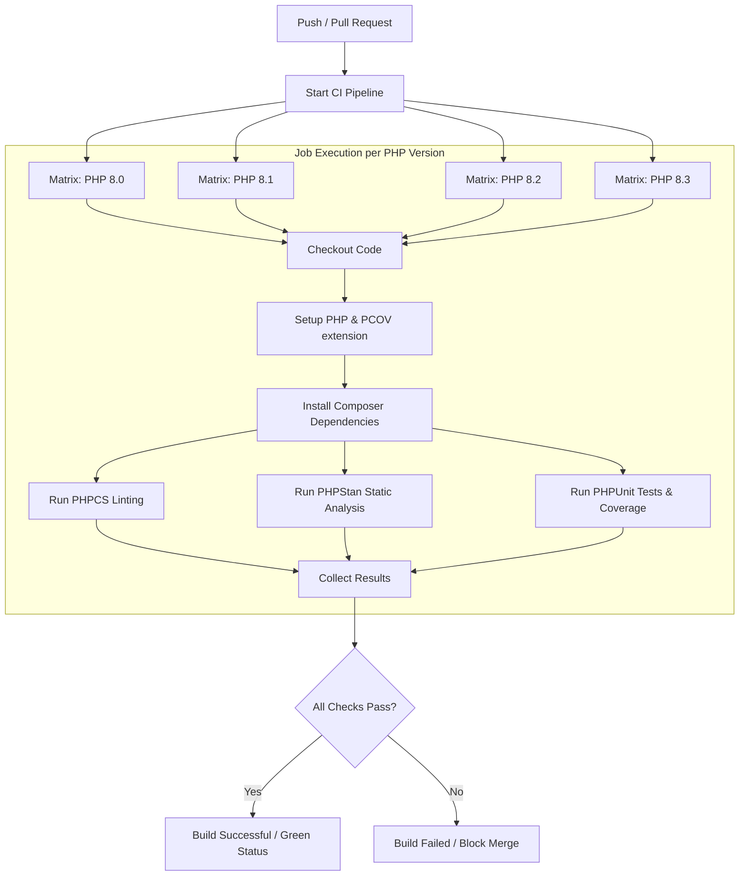

# Open Source Quality Metrics & CI/CD Documentation

This document describes the quality standards, automated verification, and performance metrics established for **PhpSwag** to ensure code reliability, maintainability, and compatibility as we prepare for the open-source release.

---

## 📊 Summary of Quality Baselines & Targets

| Metric | Tool | Current Baseline | Target Threshold | CI Enforcement |
| :--- | :--- | :--- | :--- | :--- |
| **Line Code Coverage** | PHPUnit (with Xdebug/PCOV) | **82.57%** | `>= 80%` | Warning / Codecov check |
| **Method Code Coverage** | PHPUnit (with Xdebug/PCOV) | **63.31%** | `>= 60%` | Informational |
| **Static Analysis Level** | PHPStan | **Level 7** | `Level 7` (No errors) | **Strict (Build Fails)** |
| **Coding Style Standard** | PHP_CodeSniffer | **PSR-12** | 100% Compliance | **Strict (Build Fails)** |
| **PHP Compatibility** | GitHub Actions Matrix | **PHP 8.0 - 8.3** | `PHP >= 8.0` | **Strict (Build Fails)** |
| **OpenAPI Spec Validity** | PhpSwag CLI Validator | **100% Valid** | No validation errors | **Strict (Build Fails)** |

---

## 🛠 How to Measure Metrics Locally

### 1. Running Unit Tests and Code Coverage
To run tests and see the code coverage breakdown on your local machine, ensure you have **Xdebug** or **PCOV** installed.

```bash
# Run tests with Xdebug coverage
php -d xdebug.mode=coverage vendor/bin/phpunit --coverage-text

# Or generate an HTML report for visual inspection of uncovered lines
php -d xdebug.mode=coverage vendor/bin/phpunit --coverage-html coverage-report/
```
The coverage report will show a breakdown by class, method, and line.
* *Note on Class Coverage (30.19%):* This is due to several Data Transfer Objects (DTOs) and AST-based IR nodes (e.g. `PropertyDefinition`, `RouteDefinition`) that contain property definitions but few to no methods, which is normal for AST representation libraries. Focus should remain on maintaining high **Line Coverage** (>80%).

### 2. Static Analysis (PHPStan)
We run PHPStan at **Level 7** to ensure strong type-safety, which is crucial for a framework-agnostic library handling code parsing (AST) and reflection.

```bash
# Run static analysis
./vendor/bin/phpstan analyse --memory-limit=512M
```
Configuration settings can be adjusted in [phpstan.neon](phpstan.neon).

### 3. Coding Style (PHP_CodeSniffer)
We enforce the standard PSR-12 code style using `phpcs`.

```bash
# Check code style issues
./vendor/bin/phpcs

# Automatically fix correctable issues (spacing, brackets, etc.)
./vendor/bin/phpcbf
```
Rules and exclusions (such as line length limits in test fixtures) are defined in [phpcs.xml](phpcs.xml).

### 4. OpenAPI Specification Validation
Ensure that changes to the generator do not produce malformed OpenAPI specs. Use the built-in validator:

```bash
# Generate and validate output spec
./vendor/bin/phpswag generate --validate
```
This checks for:
- Missing title, description, or version fields.
- Duplicate routes or operation IDs.
- Unresolved `$ref` schemas in components.

---

## 🚀 CI/CD Pipeline Architecture

Our CI/CD workflow is configured in [.github/workflows/ci.yml](.github/workflows/ci.yml) and runs automatically on all pushes and pull requests to `main`, `master`, and development branches.



### Key Workflow Features:
1. **PHP Matrix**: Ensures the library runs perfectly on all major PHP versions from 8.0 up to 8.3, preserving compatibility.
2. **Speed Optimizations**:
   - Uses `actions/cache` to cache Composer dependency directories, reducing run time by up to 70%.
   - Uses `pcov` for code coverage analysis, which is significantly faster than Xdebug.
3. **Strict Mode**: The build fails immediately if coding standard checks (`phpcs`) or static analysis (`phpstan`) fail.

---

## 🏷 Badges for README.md

Add these badges to the top of your `README.md` to display status and statistics to the open-source community:

```markdown
[](https://github.com/tolawho/phpswag/actions)
[](https://codecov.io/gh/tolawho/phpswag)
[](https://packagist.org/packages/phpswag/phpswag)
[](https://github.com/phpstan/phpstan)
[](https://opensource.org/licenses/MIT)
```

---

## 📝 Pre-Commit Checklist for Developers

To keep statistics green, developers should run this single shorthand composer script before pushing any code:

```bash
composer lint && composer test
```
This is equivalent to running:
1. `phpcs` (Code style check)
2. `phpstan` (Static analysis)
3. `phpunit` (Unit tests)
